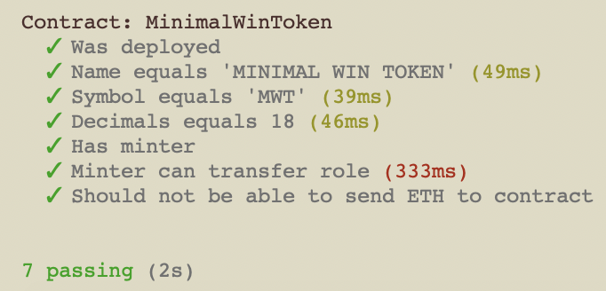
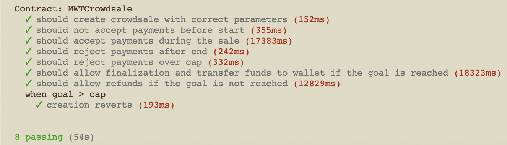
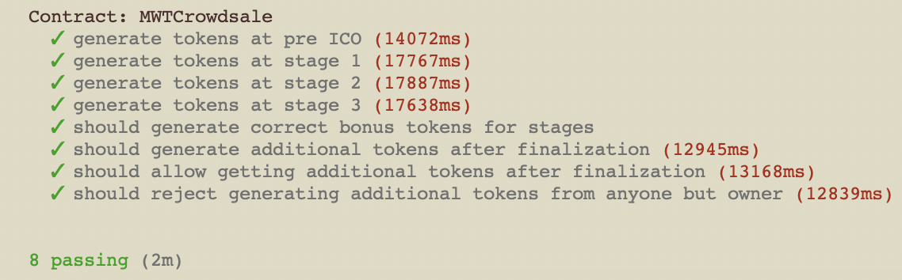
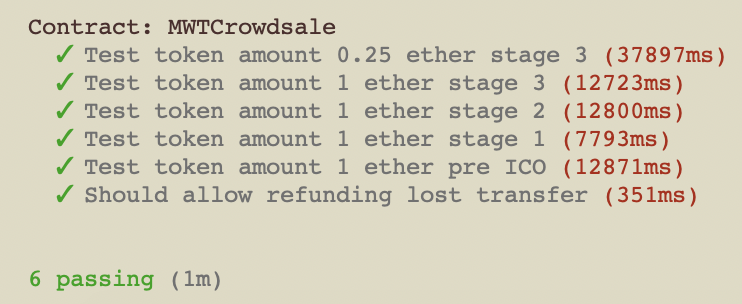

# MinimalWin

MinimalWin is an alternative platform for sales, which is based on the principle of lottery
and auction. Every object put on sale on the platform will be brought into play in case of
successful holding of the lot, only one winner will be designated. 

MinimalWin is a platform that is built entirely on Ethereum smart contracts. Total decentralization allows the transparent organization of the lottery. The winner of each round of sales will be chosen using a specific algorithm. Every lottery participant will offer at least one ticket to be able to participate in the lottery. In case the amount of tickets will not be collected, the smart contract will return all tokens to the participants willing to buy the lot put up for sale. 

Distribution and payout procedures are transparent and supported by smart contracts. The transparency and the trust attributed to the smart contracts operating on the blockchains, derive from the fact that all agreements are executed automatically and allow no third-party access or administrator intervention. When the amount requested by the seller is collected and the sale takes place:
1. the system sends the code to the buyer winner;
2. the seller delivers the lot;
3. the buyer receives the lot and sends the code to the seller;
4. the seller enters the code in his profile and receives the tokens.

MinimalWin is the first platform in the world that is built entirely on Ethereum smart
contracts which allows you to win through an algorithm everything that is put on sale on
our platform. It’s a kind of lottery, but unusual one, kind an auction, but not finished or
concluded. Our aim is to built a platform that creates an innate trust in a potentially
corrupt system for one to win something that is auctioned through a decentralized
blockchain system that benefits all.

# Instructions for testing
## To compile:
Change **_escrow** visibility in RefundableCrowdsale to **internal** from **private**

Change **_weiRaised** visibility in Crowdsale to **internal** from **private**

Run: 

    truffle compile

## To test:
Launch Ganache on port 7545 
>Or any other development tool on different port. Just make sure to use it in following commands and configure for test network in **truffle.js**. Also you will need to update port in each test in web3 constructor

Run: 

    ethereum-bridge -H localhost:7545 -a 5 --dev
and wait till it fully loads. Do not close this console window till the end of testing.

Run: 

    truffle test test/minimal_win_token.js --network test

    truffle test test/m_w_t_crowdsale1.js --network test

    truffle test test/m_w_t_crowdsale2.js --network test

    truffle test test/m_w_t_crowdsale3.js --network test

to run all test scenarios

## To migrate:
Delete **build** folder

Run: 

    truffle migrate --network development